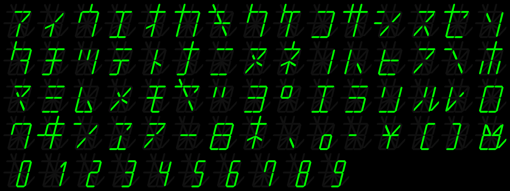

# Segment Display demo

This program draws segment display characters from a series of bitmaps, each bit corresponding to a segment in the display.

The glyphs will be output as PNG files in the folder output/ of the current directory.

